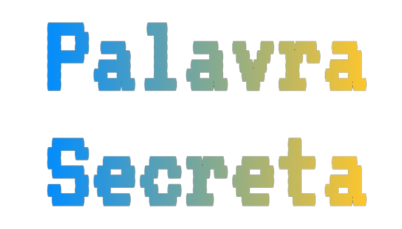

[![Contributors][contributors-shield]][contributors-url]
[![Forks][forks-shield]][forks-url]
[![Stargazers][stars-shield]][stars-url]
[![Issues][issues-shield]][issues-url]
[![MIT License][license-shield]][license-url]

  

  <h3 align="center">Secret word - Palavra Secreta</h3>

  

    A simple word guessing game 
     
    <a href="https://github.com/othneildrew/Best-README-Template"><strong>Explore the docs »</strong></a>
     
     
    <a href="https://github.com/othneildrew/Best-README-Template">View Demo</a>
    ·
    <a href="https://github.com/othneildrew/Best-README-Template/issues">Report Bug</a>
    ·
    <a href="https://github.com/othneildrew/Best-README-Template/issues">Request Feature</a>
  

## Sobre o projeto Secret Word

O Secret word é uma aplicação web criada com React e tem como inspiração um jogo muito famoso no Brasil, o jogo da forca. O objetivo do jogo é adivinhar o maximo de palavras possíveis, o jogo te oferece uma dica da palavra, Inicialmente você começa com 6 vidas, toda vez que você erra uma letra, você perde 1 vida. O jogo marca a pontuação no topo, cada palavra certa vale 100 pontos. O objetivo é adivinhar o maximo de palavras e obter a maior pontuação possível.

Acesse https://raphaelnsilva.github.io/secretword/ experimente o jogo você mesmo.

[contributors-shield]: https://img.shields.io/github/contributors/raphaelnsilva/secretword.svg?style=for-the-badge
[contributors-url]: https://github.com/raphaelnsilva/secretword/graphs/contributors
[forks-shield]: https://img.shields.io/github/forks/raphaelnsilva/secretword.svg?style=for-the-badge
[forks-url]: https://github.com/raphaelnsilva/secretword/network/members
[stars-shield]: https://img.shields.io/github/stars/raphaelnsilva/secretword.svg?style=for-the-badge
[stars-url]: https://github.com/raphaelnsilva/secretword/stargazers
[issues-shield]: https://img.shields.io/github/issues/raphaelnsilva/secretword.svg?style=for-the-badge
[issues-url]: https://github.com/raphaelnsilva/secretword/issues
[license-shield]: https://img.shields.io/github/license/raphaelnsilva/secretword.svg?style=for-the-badge
[license-url]: https://github.com/raphaelnsilva/secretword/blob/master/LICENSE.txt
